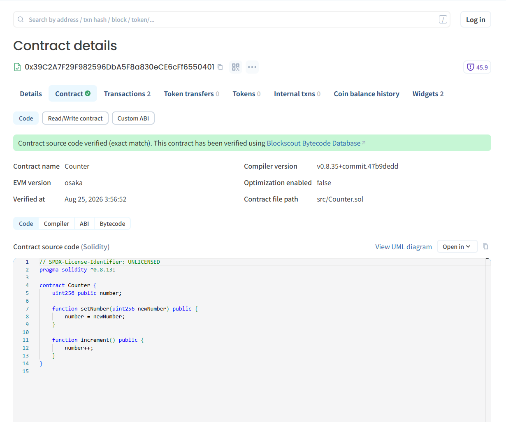

# Arc 한국어 빌드 가이드

> A tested Korean beginner guide for deploying and interacting with a Solidity smart contract on Arc Testnet using Foundry.

[](https://testnet.arcscan.app/)
[](https://docs.arc.io/)
[](https://testnet.arcscan.app/address/0x7619D52F4C7A516973ee58c362c59Fd79612D4DE)

## Arc Korea Build Proof — Live Onchain App

Arc Korea Build Proof is an open-source onchain registry where builders can publish a project name, public URL, and wallet address on Arc Testnet.

* **Live app:** https://3624341.github.io/arc-korean-build-guide/build-proof/
* **Korean build guide:** https://3624341.github.io/arc-korean-build-guide/
* **Verified BuildProof contract:** https://testnet.arcscan.app/address/0x7619D52F4C7A516973ee58c362c59Fd79612D4DE
* **Deployment transaction:** https://testnet.arcscan.app/tx/0x39a67dfdc64e3ea47b1936c26312333572066ccef17337533bc9d00c7bdc787b
* **First onchain project registration:** https://testnet.arcscan.app/tx/0x9dd0e8898d1efd4dd60d8ccf7486f9240ba6323f69dd8121d934141e442ca7e1

### What was built

* EVM wallet connection and automatic Arc Testnet switching
* Onchain project registration and public registry
* Verified Solidity smart contract with exact-match source verification
* Input validation for project names and HTTPS URLs
* Five Foundry tests with `5 passed, 0 failed`
* English builder interface with Korean community context
* Public Arcscan links for independent verification

The first registered project is the Arc Korean Build Guide. This project is an unofficial community initiative focused on building, documentation, testing, and Korean developer onboarding. It does not provide rewards, trading tools, or price speculation.


## Live guide

**https://3624341.github.io/arc-korean-build-guide/**

공식 Arc 문서를 바탕으로 한국어 초보자가 실제 배포까지 따라 할 수 있도록 재구성한 비공식 커뮤니티 가이드입니다. 단순 번역에 그치지 않고, 작성자가 모든 단계를 Arc Testnet에서 직접 실행하고 검증했습니다.

## What this guide covers

- Windows WSL 및 Ubuntu 개발 환경 설정
- Foundry 설치와 `hello-arc` 프로젝트 생성
- Arc Testnet RPC 연결
- Counter 컨트랙트 로컬 테스트
- 암호화된 Foundry keystore 생성
- Circle Faucet에서 테스트넷 USDC 수령
- Counter 컨트랙트 배포
- Blockscout 소스 코드 검증
- `cast call`을 이용한 상태 조회
- `cast send`를 이용한 `increment()` 실행
- 초보자가 겪을 수 있는 오류와 해결 방법

## Verified deployment

직접 배포한 Counter 컨트랙트는 Arc Testnet Explorer에서 소스 코드가 **Exact Match**로 검증됐습니다.

| Item | Value |
|---|---|
| Network | Arc Testnet |
| Chain ID | `5042002` |
| Gas token | USDC |
| Contract | [`0x39C2A7F29F982596DbA5F8a830eCE6cFf6550401`](https://testnet.arcscan.app/address/0x39C2A7F29F982596DbA5F8a830eCE6cFf6550401) |
| Deployment transaction | [`0xfb4609...0db57b0`](https://testnet.arcscan.app/tx/0xfb46094eb099fb9bd80ede7e15dd2d714d1ce30498f578655aeed603f0db57b0) |
| Source verification | Exact match |
| Interaction result | `number: 0 → 1` |
| Last verified | August 25, 2026 |



## Key commands

```bash
# Confirm Arc Testnet
cast chain-id --rpc-url "$ARC_TESTNET_RPC_URL"

# Run local tests
forge test

# Deploy Counter with an encrypted keystore
forge create src/Counter.sol:Counter \
  --rpc-url "$ARC_TESTNET_RPC_URL" \
  --account arc-deployer \
  --broadcast

# Read the current value
cast call "$COUNTER_ADDRESS" "number()(uint256)" \
  --rpc-url "$ARC_TESTNET_RPC_URL"

# Increment the value onchain
cast send "$COUNTER_ADDRESS" "increment()" \
  --rpc-url "$ARC_TESTNET_RPC_URL" \
  --account arc-deployer
```
## Arc Doctor

Arc Doctor is a small open-source diagnostic tool for checking an Arc Testnet
development environment before deployment. It checks WSL, required commands,
the configured RPC, Arc Testnet chain ID, optional wallet balance, and Foundry
project tests without reading a private key, seed phrase, or keystore password.

Run it from the repository root after loading the RPC environment variable:

```bash
source .env
bash scripts/arc-doctor.sh foundry
```

To include a public wallet balance check, provide only the public address:

```bash
ARC_WALLET_ADDRESS="0xYourPublicAddress" \
  bash scripts/arc-doctor.sh foundry
```

`Result: READY` means all required checks passed. `Result: NOT READY` lists the
checks that need attention. Never enter a private key, seed phrase, or password
into Arc Doctor.

## Repository structure

```text
app/                 Original site source
docs/                Static GitHub Pages site
docs/assets/         Verification screenshots
foundry/src/         Deployed Counter contract source
foundry/test/        Counter contract tests
foundry/script/      Deployment script
```

## Official references

- [Arc developer documentation](https://docs.arc.io/)
- [Deploy on Arc](https://docs.arc.io/arc/tutorials/deploy-on-arc)
- [Arc Testnet Explorer](https://testnet.arcscan.app/)
- [Foundry documentation](https://getfoundry.sh/)
- [Circle Testnet Faucet](https://faucet.circle.com/)

## Disclaimer

This is an unofficial Korean community guide and is not affiliated with or endorsed by Arc or Circle. Arc is currently in its testnet phase, so network details and tooling may change. Always check the official documentation before deploying.
